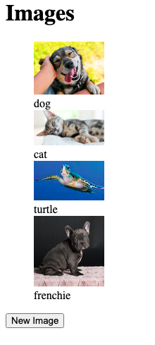
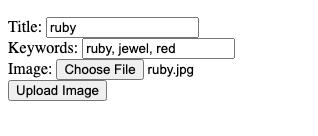
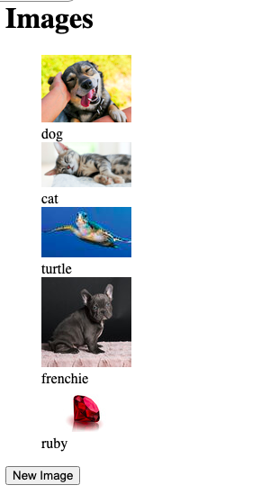

# README

# Intro 
This application was developed based on the "Getting Started" guide located [here](https://guides.rubyonrails.org/getting_started.html) in the rails docs.

This is my first attempt at working with Rails, allowing users to upload and view their images on a web application using [Rails Active Storage](https://edgeguides.rubyonrails.org/active_storage_overview.html), for now to be stored locally, but to scale to multiple users we would need some kind of cloud storage, it seems s3 is preferred for most Rails applications.

# Startup

To start using the application, simply run the command:

 `make start`

 And open the application at http://0.0.0.0:3000.

 Note: the initial start time will be a few minutes, as the dependencies must be installed. 
 However the next start will leverage the cache from the previous build and should be much faster.

 `make start` builds a docker image called railsapp, and starts running a container of that image, publishing to port 3000.

 # Usage

 Click "New Image" on the homepage to upload an image. 

 

 Fill in the form and select an image file from your local file system, and click "Upload Image".
 
 

 This will take us back to the home page with your image added to the screen. 

The addition of a 'keywords' attribute was meant to help facilitate a sophisticated search feature in the future. 
